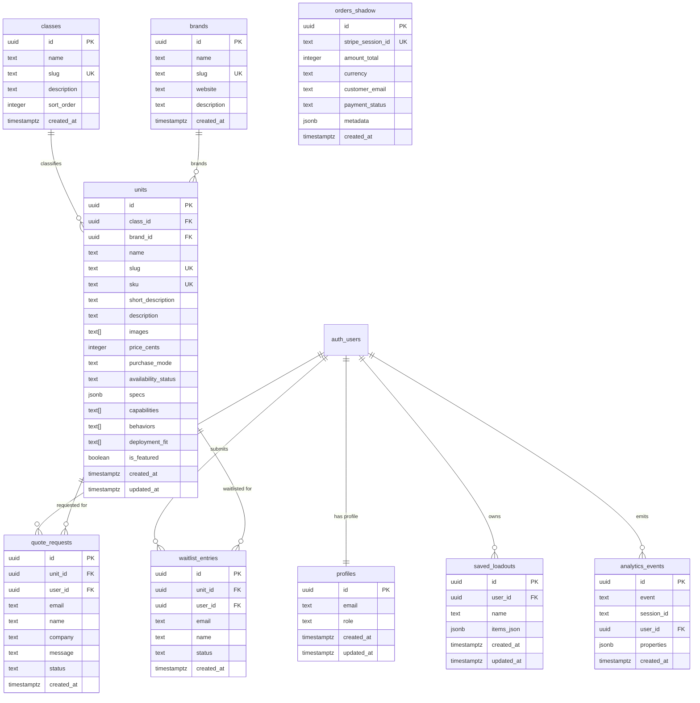

# ROBOT_STORE // Data Model

> Full relational schema and operational data model for RobotStore.app  
> Covers catalog, identity, commerce, telemetry, and operator workflows.

For product overview, see [`README.md`](../README.md).  
For system mechanics and invariants, see [`architecture.md`](./architecture.md).

---

## Table of Contents

1. [Model Philosophy](#model-philosophy)
2. [Entity Overview](#entity-overview)
3. [ERD](#erd)
4. [Core Catalog Schema](#core-catalog-schema)
5. [Identity & Access Schema](#identity--access-schema)
6. [Commerce Schema](#commerce-schema)
7. [Operator Workflow Schema](#operator-workflow-schema)
8. [Telemetry Schema](#telemetry-schema)
9. [Full SQL Reference](#full-sql-reference)
10. [Indexes](#indexes)
11. [RLS Intent Matrix](#rls-intent-matrix)
12. [Data Lifecycle Notes](#data-lifecycle-notes)
13. [Operational Queries](#operational-queries)
14. [Migration Strategy Notes](#migration-strategy-notes)

---

## Model Philosophy

RobotStore's data model is designed around five principles:

**1. Catalog truth lives in the database**
- Products, classes, brands, and statuses are DB-governed
- Hardcoded content is fallback only — the admin console is the source of truth

**2. Payment truth is webhook-driven**
- Stripe webhook writes `orders_shadow`
- Client success screens are never treated as authoritative

**3. Operator intent is valuable even before purchase**
- Quotes, waitlists, compare flows, saved loadouts, and telemetry are all first-class records

**4. Behavioral learning must remain auditable**
- Telemetry is append-only
- Scoring is tuned through config, not schema mutation

**5. Admin authority must remain explicit**
- RBAC is anchored in `public.profiles.role`
- No implicit privilege escalation

---

## Entity Overview

| Domain | Tables |
|---|---|
| Identity | `auth.users` (Supabase managed), `public.profiles` |
| Catalog | `brands`, `classes`, `units` |
| Commerce | `orders_shadow` |
| Operator workflows | `quote_requests`, `waitlist_entries`, `saved_loadouts` |
| Telemetry | `analytics_events` |

---

## ERD



---

## Core Catalog Schema

### `brands`

Represents manufacturers or system vendors.

**Purpose:**
- Branding and provenance for catalog units
- Catalog normalization
- Admin-manageable registry

**Key constraints:**
- `slug` unique — used for URL-safe references
- Referenced by `units.brand_id`

---

### `classes`

Represents procurement taxonomy buckets:

| Slug | Description |
|---|---|
| `domestic-assistance` | Home and personal care robots |
| `industrial-systems` | Logistics, warehouse, fulfillment |
| `security-nodes` | Patrol, surveillance, perimeter |
| `educational-dev-kits` | Research, prototyping, learning |
| `humanoid-interfaces` | General purpose, multi-environment |
| `experimental-units` | Prototype-grade, research edge |

**Purpose:**
- Primary signal for the recommendation engine's `useCase` scoring
- Catalog browse and filtering
- Admin ordering via `sort_order`

**Key constraints:**
- `slug` unique — directly referenced in `config.ts` scoring profiles
- Referenced by `units.class_id`

> **Critical:** Class slugs are used directly in `config.ts` `baseMatch` objects. If a slug changes, scoring profiles must be updated in sync.

> **Fragility guard:** Documentation alone is insufficient. Add a boot-time assertion in `src/lib/recommend/scoring.ts` to catch slug drift at startup:
> ```ts
> export async function assertClassSlugIntegrity(supabase: SupabaseClient) {
>   const { data: classes } = await supabase.from('classes').select('slug');
>   const dbSlugs = new Set(classes?.map((c: {slug: string}) => c.slug) ?? []);
>   const configSlugs = Object.keys(RECOMMENDATION_CONFIG.useCase.home_assistance.baseMatch);
>   const missing = configSlugs.filter(s => !dbSlugs.has(s));
>   if (missing.length > 0) {
>     throw new Error(`config.ts drift: class slugs not in DB: ${missing.join(', ')}`);
>   }
> }
> ```
> Call from `/api/recommend/route.ts` once per cold start. Turns silent scoring failure into a hard crash with a clear message.

---

### `units`

The core catalog entity. Every procurement interaction anchors to a unit.

**Purpose:**
- Public procurement object
- Recommendation subject — scored against operator input
- Compare matrix node
- Quote / waitlist anchor
- Checkout price source of truth for `buy_now` units

**Key design decisions:**

| Field | Design rationale |
|---|---|
| `price_cents` | Nullable — many units are quote-only with no public price |
| `purchase_mode` | Explicit enum — drives UI CTA, engine scoring, and checkout validation |
| `availability_status` | Separate from `purchase_mode` — a `buy_now` unit can be `sold_out` |
| `specs` | JSONB — structured but flexible technical attributes (payload, speed, range) |
| `capabilities`, `behaviors`, `deployment_fit` | Text arrays — engine uses term-matching bonus rules against these |
| `images` | URL array — not Supabase Storage-bound; supports external URLs |

**Valid `purchase_mode` values:**

| Value | Meaning |
|---|---|
| `buy_now` | Direct Stripe checkout available |
| `partner_quote` | Requires partner RFQ — pricing not public |
| `inquiry_only` | Contact-only, no automated flow |
| `waitlist` | Queue position only — allocation TBD |
| `affiliate` | External link — not transacted on-platform |

**Valid `availability_status` values:**

| Value | Scoring bonus |
|---|---|
| `available` | +5 |
| `low_stock` | +4 |
| `waitlist_open` | +2 |
| `partner_only` | +2 |
| `archived` | 0 — excluded from recommendations |
| `sold_out` | 0 |

---

## Identity & Access Schema

### `auth.users`

Managed entirely by Supabase Auth. Not directly modified.

**Purpose:**
- Identity root for all authenticated sessions
- PKCE auth flow owner
- Referenced by all operator tables

---

### `profiles`

One-to-one extension of `auth.users`.

**Purpose:**
- Role storage for RBAC
- Display-level operator metadata

**Key field — `role`:**

| Value | Access |
|---|---|
| `user` (default) | Authenticated operator — quotes, loadouts, waitlists |
| `admin` | Full admin console — `/admin/*` routes, catalog CRUD |

**Design choice:** No auto-promotion logic exists. The first admin is promoted manually via Supabase Studio SQL editor. This prevents accidental escalation and keeps the privilege boundary explicit.

---

## Commerce Schema

### `orders_shadow`

Append-only payment truth table, written exclusively by the Stripe webhook handler.

**Purpose:**
- Immutable payment log
- Admin visibility via `/admin/orders`
- Reconciliation artifact for checkout pipeline debugging

**Critical invariants:**

| Invariant | Enforcement |
|---|---|
| Written by webhook only | API route uses service role key — no client write path |
| `stripe_session_id` unique | Duplicate webhook deliveries are idempotent |
| Client never writes here | No RLS insert policy for `anon` or `authenticated` |
| Not an ERP table | Minimal fields only — not a full order management system |

**`metadata` JSONB shape (Stripe session data):**
```json
{
  "line_items": [...],
  "customer_details": { "email": "..." },
  "payment_intent": "pi_..."
}
```

---

## Operator Workflow Schema

### `quote_requests`

Stores operator RFQs for `partner_quote` and `inquiry_only` units.

**Supports:**
- Anonymous submissions (no account required)
- Authenticated submissions (linked to user profile)
- Admin review queue in `/admin/quotes`

**Design notes:**
- `user_id` nullable — anonymous friction reduction is intentional
- `email` always present — contact path exists even for anonymous
- `unit_id` anchors request to a specific unit (can be null if unit deleted)
- `status` is admin-operational — not surfaced to the submitting operator

**Valid `status` values:** `pending` → `reviewing` → `responded` → `closed`

---

### `waitlist_entries`

Stores unit allocation interest for `waitlist` mode units.

**Design notes:**
- Intentionally lightweight — no position number, no estimated date
- Status transitions happen manually by admin
- Anonymous entry is allowed — email is the contact anchor

**Valid `status` values:** `queued` → `contacted` → `closed`

---

### `saved_loadouts`

Stores operator-defined deployment configurations for B2B evaluation cycles.

**Purpose:**
- Save and restore procurement sets across sessions and devices
- Support longer multi-stakeholder evaluation workflows
- Persist state beyond browser session

**Design notes:**
- `items_json` stores serialized `CartItem[]` — intentionally denormalized
- Denormalization is correct here: unit data at save time may differ from unit data at restore time; the operator should be aware of this, not the schema
- Restore semantics: overwrites active local Zustand loadout
- `user_id` non-nullable — no anonymous loadouts
- Snapshot fields inside `items_json` enable drift detection when catalog changes post-save

**`items_json` shape (with snapshot fields):**
```json
[
  {
    "unit": { "id": "...", "slug": "...", "name": "...", ... },
    "quantity": 1,
    "priceCentsAtSave": 129500,
    "availabilityAtSave": "available",
    "savedAt": "2026-04-05T10:00:00Z"
  }
]
```

The snapshot fields allow the UI to detect drift on restore: *"This unit's price has changed since you saved this loadout."* That's enterprise-grade UX — the operator sees a diff, not a silent inconsistency.

---

## Telemetry Schema

### `analytics_events`

Append-only behavioral event stream. The foundation of the calibration loop.

**Purpose:**
- Capture operator input dimensions at wizard submission
- Capture rank selection at loadout action
- Detect scoring dead zones by useCase
- Distinguish scoring mismatch from explanation mismatch
- Support "Operator Favorites" aggregation post-launch

**Design principles:**

| Principle | Implementation |
|---|---|
| Append-only | No UPDATE or DELETE in normal operation |
| Best-effort | Errors caught at client, never block user flow |
| No external SDK | Direct Supabase insert via `track.ts` |
| Anonymous-compatible | `session_id` from sessionStorage UUID |
| Structured properties | JSONB — all fields queryable with Postgres operators |

**Critical event payload shapes:**

```jsonc
// diagnostic_complete — all 5 input dimensions explicit
{
  "event": "diagnostic_complete",
  "properties": {
    "useCase": "security",
    "environment": "office",
    "budgetBand": "10k_to_20k",
    "purchasePreference": "quote_ok",
    "deploymentScale": "small_fleet"
  }
}

// result_add_to_loadout — enables override detection
{
  "event": "result_add_to_loadout",
  "properties": {
    "rank": 2,           // 1 = PRIMARY MATCH, 2+ = override
    "score": 64,         // engine confidence
    "unitId": "uuid",
    "unitSlug": "rs-sentinel-pro",
    "purchaseMode": "partner_quote",
    "classSlug": "security-nodes"
  }
}
```

> The `rank` field is the most analytically important. When `rank > 1`, the engine's recommendation was overridden. Clustering of this pattern reveals miscalibrated scoring dimensions.

---

## Full SQL Reference

```sql
-- Enable required extension
create extension if not exists pgcrypto;

-- ============================================================
-- IDENTITY
-- ============================================================

create table if not exists public.profiles (
  id         uuid primary key references auth.users(id) on delete cascade,
  email      text,
  role       text not null default 'user'
               check (role in ('user', 'admin')),
  created_at timestamptz not null default now(),
  updated_at timestamptz not null default now()
);

-- ============================================================
-- CATALOG
-- ============================================================

create table if not exists public.brands (
  id          uuid primary key default gen_random_uuid(),
  name        text not null,
  slug        text not null unique,
  website     text,
  description text,
  created_at  timestamptz not null default now()
);

create table if not exists public.classes (
  id          uuid primary key default gen_random_uuid(),
  name        text not null,
  slug        text not null unique,
  description text,
  sort_order  integer not null default 0,
  created_at  timestamptz not null default now()
);

create table if not exists public.units (
  id          uuid primary key default gen_random_uuid(),
  class_id    uuid references public.classes(id) on delete set null,
  brand_id    uuid references public.brands(id) on delete set null,

  name        text not null,
  slug        text not null unique,
  sku         text unique,

  short_description text,
  description       text,

  images      text[] not null default '{}',

  price_cents integer,  -- nullable: quote-only units have no public price

  purchase_mode text not null
    check (purchase_mode in (
      'buy_now',
      'partner_quote',
      'inquiry_only',
      'waitlist',
      'affiliate'
    )),

  availability_status text not null
    check (availability_status in (
      'available',
      'low_stock',
      'waitlist_open',
      'partner_only',
      'archived',
      'sold_out'
    )),

  specs           jsonb    not null default '{}'::jsonb,
  capabilities    text[]   not null default '{}',
  behaviors       text[]   not null default '{}',
  deployment_fit  text[]   not null default '{}',

  is_featured     boolean  not null default false,

  created_at  timestamptz not null default now(),
  updated_at  timestamptz not null default now()
);

-- ============================================================
-- COMMERCE
-- ============================================================

create table if not exists public.orders_shadow (
  id                uuid primary key default gen_random_uuid(),
  stripe_session_id text not null unique,  -- idempotency key
  amount_total      integer,
  currency          text,
  customer_email    text,
  payment_status    text,
  metadata          jsonb not null default '{}'::jsonb,
  created_at        timestamptz not null default now()
);

-- ============================================================
-- OPERATOR WORKFLOWS
-- ============================================================

create table if not exists public.quote_requests (
  id       uuid primary key default gen_random_uuid(),
  unit_id  uuid references public.units(id) on delete set null,
  user_id  uuid references auth.users(id) on delete set null,  -- nullable: anon allowed

  email    text not null,
  name     text,
  company  text,
  message  text,

  status   text not null default 'pending'
             check (status in ('pending', 'reviewing', 'responded', 'closed')),

  created_at timestamptz not null default now()
);

create table if not exists public.waitlist_entries (
  id       uuid primary key default gen_random_uuid(),
  unit_id  uuid references public.units(id) on delete set null,
  user_id  uuid references auth.users(id) on delete set null,  -- nullable: anon allowed

  email    text not null,
  name     text,

  status   text not null default 'queued'
             check (status in ('queued', 'contacted', 'closed')),

  created_at timestamptz not null default now()
);

create table if not exists public.saved_loadouts (
  id         uuid primary key default gen_random_uuid(),
  user_id    uuid not null references auth.users(id) on delete cascade,  -- required

  name       text not null,
  items_json jsonb not null,  -- serialized CartItem[] — intentionally denormalized

  created_at timestamptz not null default now(),
  updated_at timestamptz not null default now()
);

-- ============================================================
-- TELEMETRY
-- ============================================================

create table if not exists public.analytics_events (
  id         uuid primary key default gen_random_uuid(),

  event      text not null,
  session_id text,           -- anonymous sessionStorage UUID
  user_id    uuid references auth.users(id) on delete set null,  -- nullable: anon traffic
  properties jsonb not null default '{}'::jsonb,

  created_at timestamptz not null default now()
) partition by range (created_at);  -- partition from day one: pain at 200k rows, not 1M

-- Monthly partitions: create next month's partition before it starts
create table if not exists analytics_events_2026_04
  partition of public.analytics_events
  for values from ('2026-04-01') to ('2026-05-01');

create table if not exists analytics_events_2026_05
  partition of public.analytics_events
  for values from ('2026-05-01') to ('2026-06-01');

-- Rate-limit support index: used to count events per session per time window
-- API layer enforces: max 30 events / session_id / 60 seconds
create index if not exists idx_analytics_rate_limit
  on public.analytics_events(session_id, created_at);
```

---

## Indexes

```sql
-- ── CATALOG — SCORING-ALIGNED INDEXES ──────────────────────
-- Composite partial index: active units by class + purchase mode
-- Prevents full table scan on recommendation scoring queries
create index if not exists idx_units_active_class_mode
  on public.units(class_id, purchase_mode)
  where availability_status != 'archived';

create index if not exists idx_units_class_id
  on public.units(class_id);

create index if not exists idx_units_brand_id
  on public.units(brand_id);

create index if not exists idx_units_purchase_mode
  on public.units(purchase_mode);

create index if not exists idx_units_availability_status
  on public.units(availability_status);

create index if not exists idx_units_is_featured
  on public.units(is_featured);

-- GIN indexes for array term-matching (scoring bonus rules use these)
-- Add when catalog exceeds ~500 units or EXPLAIN shows seq scans on arrays
create index if not exists idx_units_capabilities_gin
  on public.units using gin (capabilities);

create index if not exists idx_units_behaviors_gin
  on public.units using gin (behaviors);

create index if not exists idx_units_deployment_fit_gin
  on public.units using gin (deployment_fit);

-- ── OPERATOR WORKFLOWS ─────────────────────────────────────
create index if not exists idx_quote_requests_unit_id
  on public.quote_requests(unit_id);

create index if not exists idx_quote_requests_user_id
  on public.quote_requests(user_id);

create index if not exists idx_quote_requests_status
  on public.quote_requests(status);

create index if not exists idx_waitlist_entries_unit_id
  on public.waitlist_entries(unit_id);

create index if not exists idx_waitlist_entries_user_id
  on public.waitlist_entries(user_id);

create index if not exists idx_waitlist_entries_status
  on public.waitlist_entries(status);

create index if not exists idx_saved_loadouts_user_id
  on public.saved_loadouts(user_id);

-- ── TELEMETRY ──────────────────────────────────────────────
create index if not exists idx_analytics_events_event
  on public.analytics_events(event);

create index if not exists idx_analytics_events_session_id
  on public.analytics_events(session_id);

create index if not exists idx_analytics_events_created_at
  on public.analytics_events(created_at);

create index if not exists idx_analytics_events_user_id
  on public.analytics_events(user_id);

-- GIN index for JSONB property queries (add when analytics volume grows)
create index if not exists idx_analytics_events_properties_gin
  on public.analytics_events
  using gin (properties);
```

---

## RLS Intent Matrix

This matrix describes the intended access pattern for each table.

| Table | anon INSERT | auth INSERT | anon SELECT | auth SELECT | auth UPDATE | auth DELETE | service role |
|---|---|---|---|---|---|---|---|
| `profiles` | ✗ | ✗ | ✗ | own row | own row | ✗ | full |
| `brands` | ✗ | ✗ | ✓ | ✓ | ✗ | ✗ | full |
| `classes` | ✗ | ✗ | ✓ | ✓ | ✗ | ✗ | full |
| `units` | ✗ | ✗ | non-archived | non-archived | ✗ | ✗ | full |
| `orders_shadow` | ✗ | ✗ | ✗ | own rows | ✗ | ✗ | full |
| `quote_requests` | ✓ | ✓ | ✗ | own rows | ✗ | ✗ | full |
| `waitlist_entries` | ✓ | ✓ | ✗ | own rows | ✗ | ✗ | full |
| `saved_loadouts` | ✗ | own rows | ✗ | own rows | own rows | own rows | full |
| `analytics_events` | ✓ | ✓ | ✗ | ✗ | ✗ | ✗ | full |

**RLS design notes:**

- `units` public read should filter `availability_status != 'archived'` — archived units are admin-visible only
- `quote_requests` and `waitlist_entries` allow anonymous inserts — friction reduction is intentional; email is the contact anchor
- `analytics_events` allows anonymous inserts but no reads outside service role — behavioral data is protected
- `orders_shadow` is written by webhook handler using service role key only — no RLS insert policy needed for client roles
- **Rate limiting on `analytics_events`:** RLS cannot enforce rate limits. Enforce at the API/edge layer: reject inserts exceeding 30 events per `session_id` per 60-second window. Use `idx_analytics_rate_limit` (already created) to query count before insert.

---

## Data Lifecycle Notes

### Catalog lifecycle

```
Admin creates unit via /admin/units
  → unit enters DB as active (or archived)
  → recommendation engine reads on next API call
  → archived units: stay in DB, excluded from scoring
  → hard delete: not recommended — breaks historical references
```

### Quote lifecycle

```
Operator submits quote form
  → INSERT into quote_requests (anonymous or authenticated)
  → Admin reviews in /admin/quotes
  → Status transitions: pending → reviewing → responded → closed
  → No automated fulfillment in current system
```

### Waitlist lifecycle

```
Operator submits waitlist form
  → INSERT into waitlist_entries
  → Admin monitors in /admin/waitlist
  → Status transitions: queued → contacted → closed
  → Allocation / batching handled outside current MVP schema
```

### Order lifecycle

```
Client initiates Stripe Checkout
  → /api/checkout creates Stripe session (prices re-fetched from DB)
  → Browser redirects to Stripe
  → Operator completes payment
  → Stripe fires webhook to /api/webhooks/stripe
  → Signature verified → INSERT into orders_shadow
  → /checkout/success renders (checkout_completed telemetry fires)
  → Admin views in /admin/orders
```

### Telemetry lifecycle

```
User action fires track(event, properties)
  → Rate-limit check: < 30 events / session_id / 60s (API layer)
  → Best-effort INSERT into analytics_events (partitioned by month)
  → Sessions accumulate
  → SQL queries run operationally (Day 3+)
  → Pattern identified → config.ts adjusted → validated → committed
  → No updates or deletes in normal operation
  → Create next monthly partition before current one expires — do not wait
```

### Deletion invariant

```
Units MUST NOT be hard-deleted.
  → availability_status = 'archived' is the only permitted "deletion"
  → Hard delete breaks:
      quote_requests.unit_id (set null by FK, but reference is lost)
      waitlist_entries.unit_id (same)
      analytics_events.properties.unitId (no FK, silently broken)
      historical scoring attributions
  → Admin UI must expose ARCHIVE only — no DELETE button
  → Optional DB-level protection:
      create rule prevent_unit_hard_delete
        as on delete to public.units do instead nothing;
```

---

## Operational Queries

Sanity queries for schema-level operational monitoring.

### Units by purchase mode
```sql
select purchase_mode, count(*)
from public.units
group by purchase_mode
order by count(*) desc;
```

### Units by availability status
```sql
select availability_status, count(*)
from public.units
group by availability_status
order by count(*) desc;
```

### Most quoted units (commercial intent signal)
```sql
select
  u.slug,
  u.name,
  count(q.id) as quote_count
from public.quote_requests q
left join public.units u on u.id = q.unit_id
group by u.slug, u.name
order by quote_count desc
limit 20;
```

### Most waitlisted units (demand signal)
```sql
select
  u.slug,
  u.name,
  count(w.id) as waitlist_count
from public.waitlist_entries w
left join public.units u on u.id = w.unit_id
group by u.slug, u.name
order by waitlist_count desc
limit 20;
```

### Saved loadouts by user (engagement depth)
```sql
select
  user_id,
  count(*) as loadout_count
from public.saved_loadouts
group by user_id
order by loadout_count desc;
```

### Orders by payment status (reconciliation check)
```sql
select payment_status, count(*)
from public.orders_shadow
group by payment_status
order by count(*) desc;
```

### Open quotes by status (admin queue health)
```sql
select status, count(*)
from public.quote_requests
group by status
order by count(*) desc;
```

### Quote + waitlist volume vs orders (market signal)
```sql
-- If RFQ+waitlist >> orders: catalog lacks accessible buy_now SKUs
select
  'orders'   as stream, count(*) from public.orders_shadow
union all
select
  'quotes'   as stream, count(*) from public.quote_requests
union all
select
  'waitlist' as stream, count(*) from public.waitlist_entries;
```

### Override heatmap — where is the engine wrong? (HIGH VALUE)
```sql
-- Average rank selected per class slug.
-- Healthy: all values close to 1.0
-- Drifting toward 2.0+ for a class = systematic scoring mismatch
select
  properties->>'classSlug'                       as class_slug,
  round(avg((properties->>'rank')::numeric), 2)  as avg_rank_selected,
  count(*)                                        as total_selections
from public.analytics_events
where event = 'result_add_to_loadout'
group by class_slug
order by avg_rank_selected desc;
```

### Conversion by purchase mode (inventory strategy signal)
```sql
-- High quotes vs 0 orders for a mode = catalog gap, not a CTA problem
select
  u.purchase_mode,
  count(distinct o.id)  as orders,
  count(distinct q.id)  as quotes,
  count(distinct w.id)  as waitlist
from public.units u
left join public.orders_shadow o
  on o.metadata->>'unit_slug' = u.slug
left join public.quote_requests q
  on q.unit_id = u.id
left join public.waitlist_entries w
  on w.unit_id = u.id
group by u.purchase_mode
order by orders desc;
```

### Dead catalog detection (wasted surface area)
```sql
-- Active units that have never appeared in any telemetry event.
-- These are invisible to operators: wrong positioning, wrong category,
-- or scored so low they never surface in recommendations.
select
  u.slug,
  u.name,
  u.purchase_mode,
  u.availability_status,
  u.created_at
from public.units u
left join public.analytics_events a
  on a.properties->>'unitId' = u.id::text
where a.id is null
  and u.availability_status != 'archived'
order by u.created_at asc;
```

---

## Migration Strategy Notes

### Recommended migration order

```
1. profiles
2. brands
3. classes
4. units
5. orders_shadow
6. quote_requests
7. waitlist_entries
8. saved_loadouts
9. analytics_events
10. indexes (all at once, after data)
11. RLS policies
```

### Safe schema evolution principles

| Action | Safe? | Notes |
|---|---|---|
| Add nullable column | ✓ | Always safe |
| Add non-nullable column with default | ✓ | Safe if default is valid |
| Remove column | ⚠️ | Verify no application references first |
| Change enum constraint | ⚠️ | Migrate existing rows first |
| Rename column | ✗ | Breaks all references — add new, migrate, drop old |
| Change `class.slug` | ✗ | Breaks `config.ts` `baseMatch` immediately |

### Critical dependency: class slugs

Class `slug` values are referenced directly inside `config.ts` scoring profiles:

```ts
// config.ts — these must match classes.slug exactly
baseMatch: {
  "industrial-systems": 24,   // ← must match classes.slug
  "security-nodes": 6,
  "humanoid-interfaces": 4
}
```

If a class slug changes in the database, the corresponding `baseMatch` keys in `config.ts` must be updated atomically. There is no FK enforcement here — this is a deliberate architecture boundary between the data layer and the scoring config.

### DO NOT collapse these layers

| Layer | Lives in | Reason |
|---|---|---|
| Scoring parameters | `config.ts` | Tunable without DB migration |
| Operational state | Database | Persistent, relational, transactional |
| Explanation logic | `scoring.ts` | Code-owned, testable |
| Behavioral analysis | SQL queries | Runtime, ad-hoc, non-destructive |

Collapsing any of these (e.g., storing scoring weights in the DB) would break the calibration loop's auditability and make the system harder to reason about without providing meaningful benefit.

---

## Final Notes

This data model is optimized for:

- **Traceability** — every operator action has a record
- **Deterministic recommendation support** — array fields exist specifically for term-matching bonus rules
- **Hybrid commerce flows** — `purchase_mode` and `availability_status` are separate, explicit dimensions
- **Admin control** — all catalog state is mutable through the admin console
- **Post-launch calibration** — telemetry schema supports the full override detection pipeline

It is **not** optimized for:

- Generic ecommerce conventions (no cart table, no SKU variants, no inventory decrement)
- Probabilistic recommendation systems (no embedding columns, no similarity indexes)
- Autonomous self-modifying ranking (no stored scoring weights)

That is deliberate.

RobotStore's data model exists to support a governed procurement engine — not just a catalog.

---

*Schema status: STABLE*  
*Telemetry: APPEND-ONLY*  
*Calibration dependency: `analytics_events` → `config.ts`*
